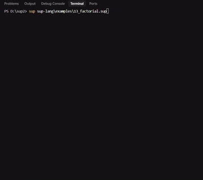

## SUP — English-like Programming Language

An English-like programming language focused on readability with deterministic semantics.

[](https://github.com/Karthikprasadm/Sup/actions/workflows/ci.yml)
[](https://karthikprasadm.github.io/Sup)
[](https://pypi.org/project/sup-lang/)
[](https://codecov.io/gh/Karthikprasadm/Sup)
[](https://marketplace.visualstudio.com/items?itemName=wingspawn.sup-language-support)
[](../LICENSE)



### Contents

- Installation
- Quickstart
- CLI usage
- Formatter and linter
- Language overview
- Developing locally
- Links

### Installation

Install from PyPI:
```
pip install sup-lang
```

From source (editable):
```
python -m venv .venv
.venv\\Scripts\\activate
pip install -e .
```

### Quickstart

Run an example:
```
sup examples/06_mixed.sup
```

Hello world:
```
sup
  print "Hello, SUP!"
bye
```

### CLI usage

Run a file:
```
sup path/to/program.sup
```
Emit Python for a single source:
```
sup --emit python path/to/program.sup
```
Transpile entry + imports to a folder and run:
```
sup transpile path/to/entry.sup --out dist_py
python dist_py/run.py
```
Debug a program (break/step/next/print):
```
sup --debug path/to/entry.sup
```
Profile and coverage:
```
supprof path/to/entry.sup
supcov path/to/entry.sup
```

Formatter and linter:
```
supfmt path/to/program.sup
suplint path/to/program.sup
```

Project commands:
```
sup init myapp
sup build main.sup --out dist_sup
sup lock main.sup
sup test tests/
sup publish .
```
Check version:
```
sup --version
```

3. Run tests (with coverage in CI):
```
pip install pytest
pytest
```

### Language Tour (MVP)

Program structure:
```
sup
  print add 2 and 3
bye
```

Assignments and expressions:
```
sup
  set x to add 10 and 5
  print the result
  print subtract 3 from x
bye
```

Conditionals and loops:
```
sup
  set a to 5
  set b to 3
  if a is greater than b then
    print a
  end if
  repeat 3 times
    print multiply a and b
  end repeat
bye
```

Input:
```
sup
  ask for name
  print name
bye
```

Comments: lines starting with `note` are ignored.

Errors are reported with line numbers and suggestions.

### Phase 2: Functions, Strings, Transpiler

Functions:
```
sup
  define function called area with width and height
    set result to multiply width and height
    return result
  end function

  print call area with 5 and 6
bye
```

Strings:
```
sup
  set name to "Ada"
  print name
bye
```

Transpiler to Python:
```
sup --emit python examples/07_functions.sup
```

Transpile a project (entry + imports) to Python files:
```
sup transpile examples/12_imports.sup --out dist_py
python dist_py/run.py
```
Notes:
- The transpiler performs a DFS on imports and writes sanitized module names into `dist_py/`.
- `run.py` calls the transpiled entry module's `__main__()` to execute top-level code.

### Phase 3: Collections and Stdlib

Lists and Maps:
```
sup
  make list of 1, 2, 3
  push 4 to list
  print the list
  pop from list
  print the list

  make map
  set "name" to "Karthik" in map
  set "age" to 21 in map
  print get "name" from map
  delete "age" from map
  print the map
bye
```

Stdlib:
- Math: `power of A and B`, `sqrt of X`, `absolute of X`
- String: `length of S`, `upper of S`, `lower of S`, `concat of A and B`
- List: `push`, `pop`, `length of <list>`

Indexing and access:
```
sup
  make list of 1, 2, 3
  print get 0 from list    # prints first element
  make map
  set "k" to 42 in map
  print get "k" from map
bye
```

### Phase 4: Conditionals, Loops, Booleans

Conditionals with else:
```
sup
  if x is greater than 5
    print "big"
  else
    print "small"
  end if
bye
```

While and For Each:
```
sup
  set x to 0
  while x is less than 3
    print x
    set x to add x and 1
  end while

  make list of 1, 2, 3
  for each item in list
    print item
  end for
bye
```

Booleans:
- Operators: `and`, `or`, `not`
- Comparisons: `is equal to`, `is not equal to`, `is greater than`, `is less than`, `is greater than or equal to`, `is less than or equal to`

### Phase 5: Errors and Imports

Errors:
```
sup
  try
    throw "oops"
  catch e
    print e
  finally
    print "done"
  end try
bye
```

Imports:
```
sup
  import mathlib
  print mathlib.pi
  from mathlib import square as sq
  print call sq with 3
bye
```

Notes:
- Interpreter searches modules in `SUP_PATH` (os.pathsep-separated) then CWD.
- Transpiler emits Python `import`/`from` statements; ensure modules exist as Python when executing transpiled code.

### Additional built-ins

- Math: `min of A and B`, `max of A and B`, `floor of X`, `ceil of X`
- String: `trim of S` (strip whitespace), `upper of S`, `lower of S`, `concat of A and B`
- Contains/join:
  - `contains of L and X` where L is a list (true if X in list)
  - `contains of S and T` where S,T are strings (substring check)
  - `join of SEP and LIST` (e.g., `join of "," and list`)

### Error handling notes

- `throw <expr>` raises a runtime error carrying the raw value of `<expr>`; in `catch e`, the variable `e` receives that raw value.
- `finally` always runs whether the `try` body throws or not; if there is no `catch`, the error is re-raised after `finally`.

### Circular imports

- The interpreter detects circular imports and raises a friendly error identifying the module involved.

### Test runner

- To run tests reliably in terminals that buffer output, use:
```
\.venv\Scripts\python sup-lang\tools\run_tests.py
```

### Links

- Docs: https://karthikprasadm.github.io/Sup
- VS Code extension: https://marketplace.visualstudio.com/items?itemName=wingspawn.sup-language-support
- PyPI: https://pypi.org/project/sup-lang/
- Issues: https://github.com/Karthikprasadm/Sup/issues

